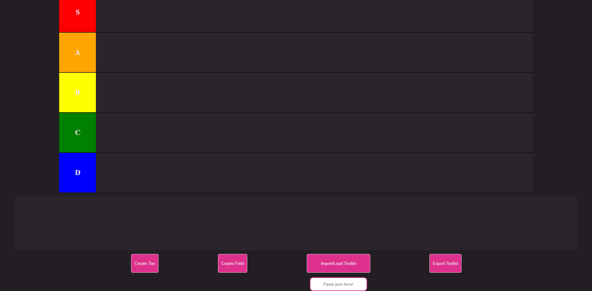

# UG's easy tierlist visualizer (ETV)
Online tierlist maker and visualizer. Share your tierlist with friends and have fun!

You can visit the website [by clicking here](https://ugdev.xyz/ETV)! (It's not up yet, give me a break)

## TLDR?
You can make tierlists with any data. 

*Yes, that's it.* You can then export them as a JSON file / raw text and share them with friends so they can do their own versions of your tierlist! You can create custom tiers with custom colors, add as many images as you'd like and even add a link on every field. 

Fast, easy and no unnecessary extras. <3

## Stuff to be added...
- Default tierlist presets.
- More tier customization.
- Uhhh... that's it probably? I'm open for ideas!